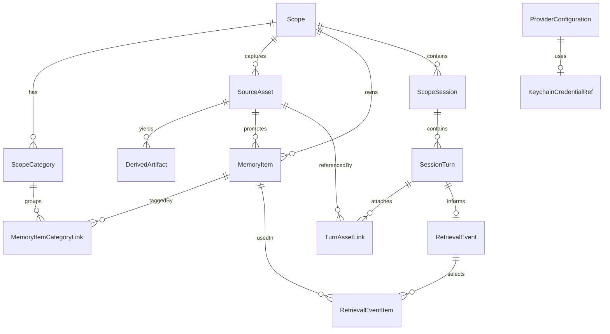

# Core Data Model

## Purpose

This document defines the first-pass domain model for `Scope`.

It should be concrete enough to:

- guide the first SwiftData implementation
- keep product concepts and storage concepts aligned
- support the first prototype screens
- stay compatible with `v1.5` sync and export work later

This is a product-facing data model, not a final database schema.

## Modeling Principles

1. `Scope` is the primary container
2. `MemoryItem` is the primary retrieval unit
3. original sources are retained
4. derived artifacts are stored separately from promoted memory
5. categories guide both storage and retrieval
6. local working state should be sync-ready, even before sync ships

## Entity Overview

| Entity | Purpose | Primary store |
|---|---|---|
| `Scope` | top-level workspace container | SwiftData |
| `ScopeCategory` | scope-specific memory/retrieval rails | SwiftData |
| `SourceAsset` | original captured source | SwiftData + filesystem |
| `DerivedArtifact` | machine-readable output from a source | SwiftData + filesystem |
| `MemoryItem` | normalized unit used for retrieval | SwiftData |
| `MemoryItemCategoryLink` | link between memories and categories | SwiftData |
| `ScopeSession` | working session inside a scope | SwiftData |
| `SessionTurn` | user or assistant turn inside a session | SwiftData |
| `TurnAssetLink` | assets attached to a turn | SwiftData |
| `RetrievalEvent` | one retrieval pass for one assistant reply | SwiftData |
| `RetrievalEventItem` | which memory items were used and why | SwiftData |
| `ProviderConfiguration` | non-secret provider settings | SwiftData |
| `AppSettings` | global app preferences | SwiftData |
| `KeychainCredentialRef` | reference to keychain-held secret | SwiftData + Keychain |

## Recommended IDs And Sync Readiness

All sync-eligible records should have:

- stable `UUID` primary keys
- `createdAt`
- `updatedAt`
- nullable `deletedAt` for soft-delete / tombstones later

This applies at minimum to:

- `Scope`
- `ScopeCategory`
- `SourceAsset`
- `DerivedArtifact`
- `MemoryItem`
- `ScopeSession`
- `SessionTurn`
- `RetrievalEvent`

## Core Entities

### `Scope`

Represents one long-lived area of life or work.

#### Key fields

| Field | Type | Notes |
|---|---|---|
| `id` | `UUID` | stable identifier |
| `title` | `String` | user-facing name |
| `normalizedTitle` | `String` | search / uniqueness helper |
| `summary` | `String?` | current `What matters here` summary |
| `iconName` | `String?` | symbol or local icon token |
| `accentToken` | `String?` | visual identity hook |
| `memoryMode` | `ScopeMemoryMode` | scope-only, relevant-global, manual-only, temporary |
| `retrievalAggressiveness` | `RetrievalAggressiveness` | low / standard / high |
| `status` | `ScopeStatus` | active / archived |
| `sortOrder` | `Double` | user-reorder support |
| `lastOpenedAt` | `Date?` | re-entry freshness |
| `createdAt` | `Date` | audit |
| `updatedAt` | `Date` | audit |
| `deletedAt` | `Date?` | future sync tombstone |

#### Notes

- `Scope` owns categories, assets, sessions, and most memory items
- `summary` is a user-visible orientation field, not a hidden system summary

### `ScopeCategory`

Represents a lightweight, scope-specific memory category.

#### Key fields

| Field | Type | Notes |
|---|---|---|
| `id` | `UUID` | stable identifier |
| `scopeID` | `UUID` | owning scope |
| `name` | `String` | user-facing label |
| `normalizedName` | `String` | search / dedupe helper |
| `source` | `CategorySource` | suggested / user-added / derived |
| `status` | `CategoryStatus` | active / disabled |
| `priority` | `CategoryPriority` | pinned / normal / low |
| `retrievalEnabled` | `Bool` | eligible in retrieval |
| `storageBehavior` | `CategoryStorageBehavior` | auto-promote / suggest-only / ignore |
| `position` | `Int` | stable display order |
| `createdAt` | `Date` | audit |
| `updatedAt` | `Date` | audit |
| `deletedAt` | `Date?` | future sync tombstone |

#### Notes

- `storageBehavior` is how categories help guide what gets saved
- categories remain lightweight; this is not meant to become a hard taxonomy system

### `SourceAsset`

Represents a captured source item.

This includes file-backed media and lighter inline sources.

Examples:

- photo
- audio recording
- text note
- clipped link
- imported document

#### Key fields

| Field | Type | Notes |
|---|---|---|
| `id` | `UUID` | stable identifier |
| `scopeID` | `UUID` | owning scope |
| `kind` | `SourceAssetKind` | image / audio / note / link / document |
| `backingStoreKind` | `SourceBackingStoreKind` | file / inline-text / url-only |
| `captureSource` | `CaptureSource` | in-app / share-sheet / import |
| `captureIntent` | `CaptureIntent` | quick-record / quick-note / generic-add / in-scope-capture |
| `displayTitle` | `String?` | short label for UI |
| `inlineText` | `String?` | note body or small text source |
| `sourceURL` | `String?` | link captures |
| `mimeType` | `String?` | media or document typing |
| `originalFilename` | `String?` | for file-backed sources |
| `relativePath` | `String?` | app-group file path |
| `byteSize` | `Int64?` | storage display |
| `durationSeconds` | `Double?` | audio |
| `widthPixels` | `Int?` | images |
| `heightPixels` | `Int?` | images |
| `checksum` | `String?` | dedupe helper |
| `retentionPolicy` | `AssetRetentionPolicy` | keep-original / compressed-only / derived-only later |
| `scopeAssignmentSource` | `ScopeAssignmentSource` | in-scope / user-selected / auto-suggested / auto-assigned |
| `scopeAssignmentConfidence` | `Double?` | optional auto-scope confidence |
| `scopeAssignmentConfidenceBand` | `AutomationConfidenceBand?` | high / medium / low |
| `scopeAssignmentActionState` | `AutomationActionState?` | silent-apply / notified-apply / requires-manual-review |
| `scopeSuggestionReason` | `String?` | terse user-facing explanation |
| `processingStatus` | `ProcessingStatus` | pending / ready / failed |
| `createdAt` | `Date` | capture time |
| `updatedAt` | `Date` | audit |
| `deletedAt` | `Date?` | future sync tombstone |

#### Notes

- `SourceAsset` is the source of truth for user-captured input
- large payloads live on disk; this record is the index
- scope assignment metadata supports low-friction capture outside a scope
- confidence metadata should support different UI outcomes, not just logging
- action state should record whether the system applied silently, applied with notice, or stopped for manual review
- the threshold policy behind those states should be configurable later even if v1 keeps it internal

### `DerivedArtifact`

Represents machine-readable output derived from a source.

Examples:

- transcript
- OCR text
- summary
- extracted entities
- structured extraction payload

#### Key fields

| Field | Type | Notes |
|---|---|---|
| `id` | `UUID` | stable identifier |
| `scopeID` | `UUID` | owning scope |
| `sourceAssetID` | `UUID?` | optional if derived from session text |
| `kind` | `DerivedArtifactKind` | transcript / ocr / summary / entities / extraction |
| `storageKind` | `ArtifactStorageKind` | inline-text / inline-json / file |
| `inlineText` | `String?` | small text payload |
| `inlineJSON` | `String?` | small structured payload |
| `relativePath` | `String?` | file-backed payload |
| `languageCode` | `String?` | transcript/OCR support |
| `extractionVersion` | `String` | pipeline versioning |
| `confidence` | `Double?` | optional extraction confidence |
| `status` | `ArtifactStatus` | ready / superseded / failed |
| `createdAt` | `Date` | audit |
| `updatedAt` | `Date` | audit |
| `deletedAt` | `Date?` | future sync tombstone |

#### Notes

- derived artifacts are not automatically memory
- only some derived artifacts should be promoted into `MemoryItem`

### `MemoryItem`

Represents a normalized piece of information eligible for retrieval.

Examples:

- `She prefers mystery novels with strong atmosphere`
- `Kyoto hotel check-in is May 12`
- `Ideas about founder positioning`
- `Quote from Joan Didion note`

#### Key fields

| Field | Type | Notes |
|---|---|---|
| `id` | `UUID` | stable identifier |
| `scopeID` | `UUID` | owning scope |
| `sourceAssetID` | `UUID?` | optional provenance |
| `derivedArtifactID` | `UUID?` | optional provenance |
| `kind` | `MemoryItemKind` | fact / preference / quote / idea / task / date / summary / note |
| `sourceKind` | `MemorySourceKind` | user-authored / extracted / inferred / imported |
| `visibility` | `MemoryVisibility` | scope-only / global-eligible |
| `reviewState` | `MemoryReviewState` | suggested / active / excluded / archived |
| `title` | `String?` | short label for UI |
| `body` | `String` | normalized text |
| `whyItMatters` | `String?` | terse user-facing rationale |
| `priority` | `MemoryPriority` | pinned / standard / low |
| `validUntil` | `Date?` | optional freshness boundary |
| `lastUsedAt` | `Date?` | retrieval freshness |
| `useCount` | `Int` | retrieval history |
| `createdAt` | `Date` | audit |
| `updatedAt` | `Date` | audit |
| `deletedAt` | `Date?` | future sync tombstone |

#### Notes

- `MemoryItem` is the primary retrieval unit
- `whyItMatters` is intentionally user-facing, not an internal-only field
- global pull is handled via `visibility`, not a separate global-memory table in v1

### `MemoryItemCategoryLink`

Links memories to one or more categories.

#### Key fields

| Field | Type | Notes |
|---|---|---|
| `id` | `UUID` | stable identifier |
| `memoryItemID` | `UUID` | linked memory |
| `categoryID` | `UUID` | linked category |
| `assignmentSource` | `CategoryAssignmentSource` | manual / extracted / inferred |
| `weight` | `Double` | relative fit |
| `createdAt` | `Date` | audit |

#### Notes

- a memory can belong to multiple categories
- weights help retrieval ranking later without exposing complexity in the UI

### `ScopeSession`

Represents one working thread inside a scope.

This is not the primary navigation unit, but it supports ongoing use.

#### Key fields

| Field | Type | Notes |
|---|---|---|
| `id` | `UUID` | stable identifier |
| `scopeID` | `UUID` | owning scope |
| `title` | `String?` | optional generated title |
| `summary` | `String?` | session-level recap |
| `status` | `SessionStatus` | active / archived |
| `startedAt` | `Date` | audit |
| `lastActivityAt` | `Date` | UI freshness |
| `createdAt` | `Date` | audit |
| `updatedAt` | `Date` | audit |
| `deletedAt` | `Date?` | future sync tombstone |

#### Notes

- scopes are primary; sessions stay subordinate
- this preserves the product’s scope-first posture while still supporting turn history

### `SessionTurn`

Represents one user or assistant turn.

#### Key fields

| Field | Type | Notes |
|---|---|---|
| `id` | `UUID` | stable identifier |
| `sessionID` | `UUID` | owning session |
| `role` | `TurnRole` | user / assistant / system |
| `text` | `String` | turn content |
| `providerKind` | `ProviderKind?` | for assistant turns |
| `modelID` | `String?` | for assistant turns |
| `status` | `TurnStatus` | complete / failed / cancelled |
| `createdAt` | `Date` | audit |
| `updatedAt` | `Date` | audit |

#### Notes

- a turn can reference attached assets through `TurnAssetLink`
- retrieval logs should point back to the assistant turn they informed

### `TurnAssetLink`

Links one turn to one or more source assets.

#### Key fields

| Field | Type | Notes |
|---|---|---|
| `id` | `UUID` | stable identifier |
| `turnID` | `UUID` | owning turn |
| `sourceAssetID` | `UUID` | linked asset |
| `role` | `TurnAssetRole` | input / reference / generated |
| `createdAt` | `Date` | audit |

### `RetrievalEvent`

Represents one retrieval pass for one assistant reply.

#### Key fields

| Field | Type | Notes |
|---|---|---|
| `id` | `UUID` | stable identifier |
| `scopeID` | `UUID` | active scope |
| `sessionID` | `UUID?` | optional session grouping |
| `assistantTurnID` | `UUID?` | reply informed by retrieval |
| `querySummary` | `String?` | terse summary for debugging / receipts |
| `globalMemoryUsed` | `Bool` | whether cross-scope memory was used |
| `strategyVersion` | `String` | retrieval engine version |
| `createdAt` | `Date` | audit |
| `updatedAt` | `Date` | audit |

#### Notes

- this is the durable record behind retrieval receipts

### `RetrievalEventItem`

Represents one memory item used during one retrieval event.

#### Key fields

| Field | Type | Notes |
|---|---|---|
| `id` | `UUID` | stable identifier |
| `retrievalEventID` | `UUID` | owning retrieval event |
| `memoryItemID` | `UUID` | used memory |
| `rank` | `Int` | order selected |
| `score` | `Double?` | retrieval weight |
| `matchedCategoryName` | `String?` | user-facing reason |
| `sourceScopeID` | `UUID` | provenance |
| `usageKind` | `RetrievalUsageKind` | primary / supporting |
| `createdAt` | `Date` | audit |

#### Notes

- storing `matchedCategoryName` denormalizes slightly for stable receipt rendering

### `ProviderConfiguration`

Stores non-secret provider preferences.

#### Key fields

| Field | Type | Notes |
|---|---|---|
| `id` | `UUID` | stable identifier |
| `providerKind` | `ProviderKind` | openai / anthropic / other |
| `displayName` | `String` | user-facing label |
| `defaultModelID` | `String?` | preferred model |
| `endpointOverride` | `String?` | optional self-host / relay later |
| `isEnabled` | `Bool` | active in UI |
| `lastValidatedAt` | `Date?` | configuration health |
| `createdAt` | `Date` | audit |
| `updatedAt` | `Date` | audit |

### `KeychainCredentialRef`

Stores a reference to a secret held in Keychain.

#### Key fields

| Field | Type | Notes |
|---|---|---|
| `id` | `UUID` | stable identifier |
| `providerConfigurationID` | `UUID` | owning provider config |
| `service` | `String` | keychain service name |
| `account` | `String` | keychain account name |
| `lastValidatedAt` | `Date?` | health hint |
| `createdAt` | `Date` | audit |
| `updatedAt` | `Date` | audit |

### `AppSettings`

Stores cross-app preferences.

#### Key fields

| Field | Type | Notes |
|---|---|---|
| `id` | `UUID` | singleton-like record |
| `defaultProviderKind` | `ProviderKind?` | app default |
| `onboardingCompletedAt` | `Date?` | first-run gating |
| `optimizeDeviceStorage` | `Bool` | v1.5-friendly flag |
| `preferredCaptureScopeID` | `UUID?` | convenience |
| `preferredQuickCaptureKind` | `QuickCaptureKind?` | likely `audio` first |
| `createdAt` | `Date` | audit |
| `updatedAt` | `Date` | audit |

## Enums

### `ScopeMemoryMode`

- `scopeOnly`
- `relevantGlobal`
- `manualOnly`
- `temporary`

### `RetrievalAggressiveness`

- `low`
- `standard`
- `high`

### `ScopeStatus`

- `active`
- `archived`

### `CategorySource`

- `suggested`
- `userAdded`
- `derived`

### `CategoryStatus`

- `active`
- `disabled`

### `CategoryPriority`

- `pinned`
- `normal`
- `low`

### `CategoryStorageBehavior`

- `autoPromote`
- `suggestOnly`
- `ignore`

### `SourceAssetKind`

- `image`
- `audio`
- `note`
- `link`
- `document`

### `SourceBackingStoreKind`

- `file`
- `inlineText`
- `urlOnly`

### `CaptureSource`

- `inApp`
- `shareSheet`
- `imported`

### `CaptureIntent`

- `quickRecord`
- `quickNote`
- `genericAdd`
- `inScopeCapture`

### `AssetRetentionPolicy`

- `keepOriginal`
- `keepCompressed`
- `derivedOnly`

### `ScopeAssignmentSource`

- `inScope`
- `userSelected`
- `autoSuggested`
- `autoAssigned`

### `ProcessingStatus`

- `pending`
- `ready`
- `failed`

### `DerivedArtifactKind`

- `transcript`
- `ocr`
- `summary`
- `entities`
- `structuredExtraction`

### `ArtifactStorageKind`

- `inlineText`
- `inlineJSON`
- `file`

### `ArtifactStatus`

- `ready`
- `superseded`
- `failed`

### `MemoryItemKind`

- `fact`
- `preference`
- `quote`
- `idea`
- `task`
- `date`
- `summary`
- `note`

### `MemorySourceKind`

- `userAuthored`
- `extracted`
- `inferred`
- `imported`

### `MemoryVisibility`

- `scopeOnly`
- `globalEligible`

### `MemoryReviewState`

- `suggested`
- `active`
- `excluded`
- `archived`

### `MemoryPriority`

- `pinned`
- `standard`
- `low`

### `CategoryAssignmentSource`

- `manual`
- `extracted`
- `inferred`

### `SessionStatus`

- `active`
- `archived`

### `TurnRole`

- `user`
- `assistant`
- `system`

### `TurnStatus`

- `complete`
- `failed`
- `cancelled`

### `TurnAssetRole`

- `input`
- `reference`
- `generated`

### `RetrievalUsageKind`

- `primary`
- `supporting`

### `ProviderKind`

- `openai`
- `anthropic`
- `customOpenAICompatible`

### `QuickCaptureKind`

- `audio`
- `note`
- `photo`

## Relationship Diagram

## Persistence Split

### SwiftData

Persist directly in SwiftData:

- `Scope`
- `ScopeCategory`
- `SourceAsset` metadata
- `DerivedArtifact` metadata and small inline payloads
- `MemoryItem`
- `MemoryItemCategoryLink`
- `ScopeSession`
- `SessionTurn`
- `TurnAssetLink`
- `RetrievalEvent`
- `RetrievalEventItem`
- `ProviderConfiguration`
- `KeychainCredentialRef`
- `AppSettings`

### App Group Filesystem

Persist on disk:

- original image files
- original audio files
- imported documents
- full transcripts when large
- OCR dumps when large
- extraction JSON when large
- generated thumbnails / previews

### Keychain

Persist in Keychain:

- provider API keys
- future relay tokens

## Query Patterns To Support In V1

The model should support these queries efficiently:

1. list active scopes sorted by recent use or manual order
2. load one scope with categories, recent memory, and latest session
3. fetch active memory items for one scope by category priority
4. fetch global-eligible memory items from other scopes lightly
5. show recent receipts for the latest assistant reply
6. load source asset details for a tapped memory or receipt row
7. show storage footprint per scope later
8. suggest the most likely destination scope for capture started outside a scope

## Retrieval Strategy Mapping

The model supports the retrieval order already agreed on:

1. user-authored `MemoryItem`
2. reviewed / active extracted `MemoryItem`
3. category-matched `DerivedArtifact` when needed
4. light global memory via `MemoryVisibility.globalEligible`

This means:

- retrieval does not need to read full raw assets by default
- receipts can point to stable records
- category tuning can directly affect retrieval eligibility

## Suggested SwiftData Shape

For implementation, start with these SwiftData model groups:

- `Scope`, `ScopeCategory`
- `SourceAsset`, `DerivedArtifact`
- `MemoryItem`, `MemoryItemCategoryLink`
- `ScopeSession`, `SessionTurn`, `TurnAssetLink`
- `RetrievalEvent`, `RetrievalEventItem`
- `ProviderConfiguration`, `KeychainCredentialRef`, `AppSettings`

Keep repository boundaries around:

- scope management
- capture and asset management
- memory promotion / review
- retrieval logging
- provider settings

## V1 Deliberate Omissions

Do not add these yet:

- collaborative users or shared scopes
- server-owned user identity
- vector index as a first-class local model
- complex workflow / task orchestration objects
- plugin / connector registries
- deep analytics event schema

## Open Questions

- whether `MemoryItemKind` should stay broad or split further once real data exists
- whether `What matters here` is fully generated, user-authored, or hybrid
- whether `ScopeSession` needs explicit pinning or whether one active session is enough
- whether `DerivedArtifact.entities` should stay opaque JSON or normalize into smaller records later
